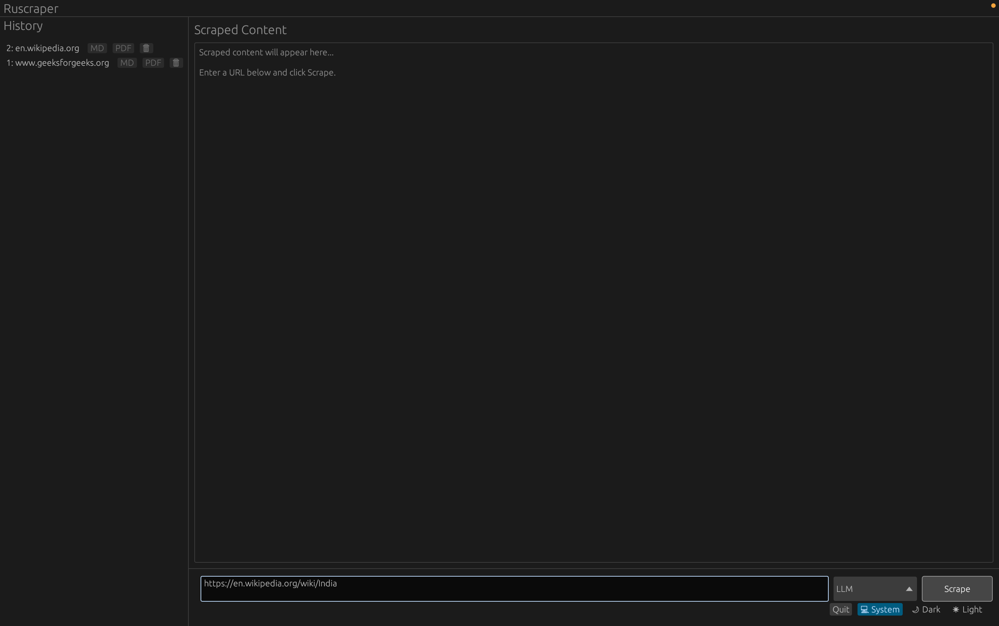
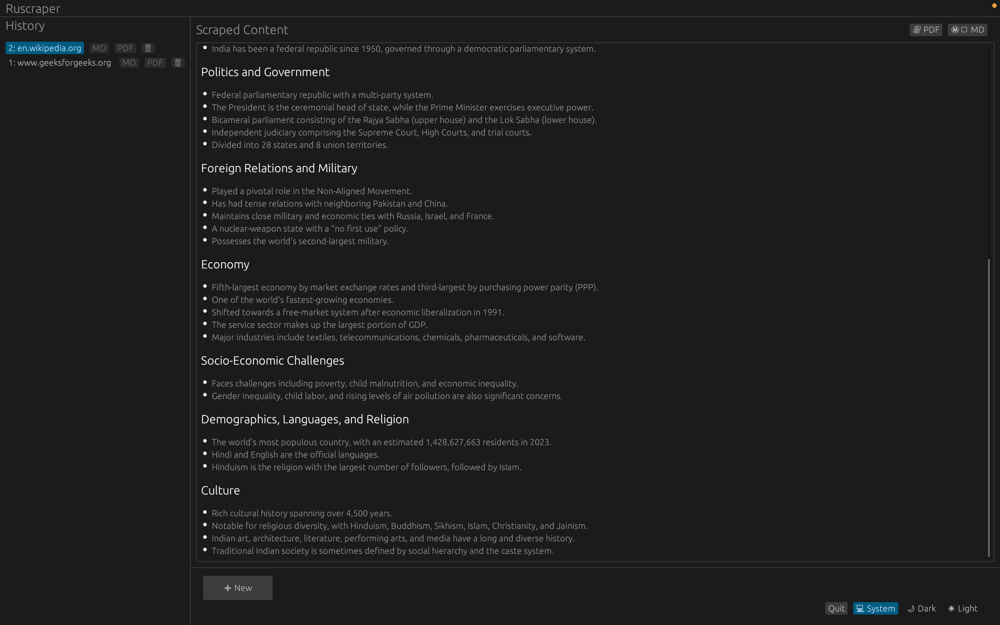
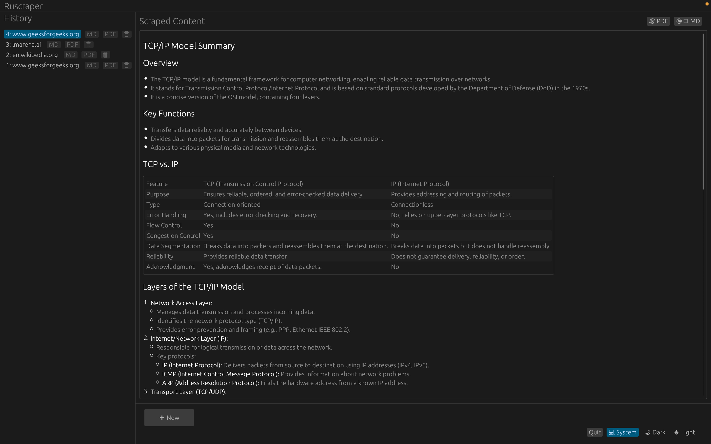

# Rust Web Scraper with LLM Summary

A modular Rust web service that scrapes web pages and uses an LLM to generate summaries.

## Features

- Clean, modular Rust architecture
- Web scraping with reqwest and scraper crates
- OpenRouter LLM integration for content summarization
- RESTful API with Axum
- Configuration via environment variables
- Proper error handling
- Standardized API response format
- Markdown-formatted summaries for better readability

## Project Structure

```
src/
├── api/
│   ├── mod.rs        # API module declarations
│   ├── models.rs     # Request/response data models
│   ├── response.rs   # API response standardization
│   └── routes.rs     # API route handlers
├── config.rs         # App configuration
├── error.rs          # Error handling
├── lib.rs            # Library exports
├── llm.rs            # LLM client for OpenRouter
├── main.rs           # Application entry point
└── scraper.rs        # Web scraping functionality
```

## Setup

1. Create a `.env` file with your OpenRouter API key:

```
OPENROUTER_API_KEY=your_api_key_here
```

2. Optionally set server configuration (defaults shown):

```
HOST=127.0.0.1
PORT=3000
```

## Running the Application

```bash
cargo run
```

The server will start on http://127.0.0.1:3000

## API Usage

**Endpoint**: `POST /api/scrape`

**Request**:
```json
{
  "url": "https://example.com"
}
```

**Response**:
```json
{
  "data": {
    "url": "https://example.com",
    "summary_markdown": "# Example Website Summary\n\n## Overview\n\n- A simple website demonstrating web content\n- Contains information about web standards\n\n## Main Content\n\nThis domain is used for illustrative examples in documents...",
    "scraped_at": "2023-05-20T14:30:00.123456Z",
    "word_count": 1250,
    "status": "success"
  },
  "meta": {
    "status": "success",
    "status_code": 200,
    "timestamp": "2023-05-20T14:30:00.123456Z",
    "message": null
  }
}
```

### Response Structure

All API responses follow a standardized format:

```json
{
  "data": { ... },  // Payload (null for errors)
  "meta": {
    "status": "success|error",
    "status_code": 200,
    "timestamp": "2023-05-20T14:30:00.123456Z",
    "message": "Error message (only present for errors)"
  }
}
```

### Scrape Response Fields

| Field | Description |
|-------|-------------|
| url | The URL that was scraped |
| summary_markdown | AI-generated summary of the webpage content formatted in Markdown |
| scraped_at | ISO 8601 timestamp when scraping occurred |
| word_count | Number of words in the processed content |
| status | Status of the scraping operation |

## Displaying Markdown Content

The summary is returned in Markdown format, which can be rendered in various ways:

- In a web application, use a Markdown renderer like `marked.js` or `showdown`
- In a mobile app, use a Markdown component like `react-native-markdown-display`
- For CLI applications, consider a tool like `termdown` to render in the terminal

Example with React:

```jsx
import ReactMarkdown from 'react-markdown';

function Summary({ data }) {
  return (
    <div className="summary-container">
      <ReactMarkdown>{data.summary_markdown}</ReactMarkdown>
    </div>
  );
}
```

## Screenshots

Here are some screenshots of the application in action:







## Dependencies

- axum - Web framework
- reqwest - HTTP client
- scraper - HTML parsing
- serde - Serialization/deserialization 
- tokio - Async runtime
- dotenv - Environment variable loading
- tower-http - Middleware (CORS)
- thiserror - Error handling
- chrono - Date and time handling 